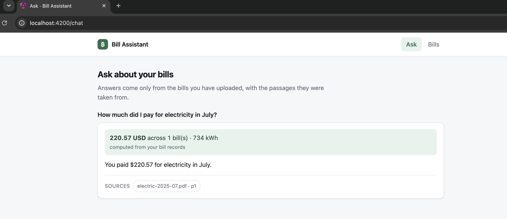

# bill-assistant

[](https://github.com/BalajiRajendiran/bill-assistant/actions/workflows/ci.yml)

Ask questions about your household utility bills in plain English, and get answers grounded in the
actual PDFs.

> "How much did I pay for electricity in July?"
> **$220.57** across 1 bill · 734 kWh
> According to the excerpts, the total amount paid for electricity in July is $220.57.
> Sources: `electric-2025-07.pdf · p1`

Upload a bill and it is parsed, chunked, embedded into [Qdrant](https://qdrant.tech), and summarised
into structured fields. Questions are answered from the retrieved passages; questions about totals are
answered from SQL, so the numbers are exact.

Runs entirely on your machine: [Ollama](https://ollama.com) (`llama3.2` + `nomic-embed-text`) for the
models, Qdrant for vectors, SQLite for bill records. Azure OpenAI can be swapped in from configuration
without touching application code.



## Stack

.NET 10 minimal API · Microsoft.Extensions.AI · Microsoft.Extensions.VectorData (Qdrant) · EF Core
(SQLite) · PdfPig · Angular 21 (standalone, signals, zoneless)

## Quickstart

Prerequisites: .NET SDK 10.0.401 (pinned in `global.json`), Node 24, Docker, Ollama.

```bash
# 1. backing services
docker compose up -d
ollama pull llama3.2
ollama pull nomic-embed-text

# 2. api  ->  http://localhost:5280   (docs at /scalar)
cd api
dotnet run --project BillAssistant.Api --urls http://localhost:5280

# 3. web  ->  http://localhost:4200
cd web
npm install --legacy-peer-deps
npm start
```

Check everything is wired up:

```bash
curl localhost:5280/health
```

It reports the provider, the models, the collection, and whether Ollama and Qdrant are actually
reachable — including whether the embedding model's dimensions match the collection's.

### Try it with the sample bills

`samples/` holds seven synthetic bills (electricity, water, gas, internet; several months, with rate
tables and a deliberate upward trend in water usage). No real account data.

```bash
for f in samples/*.pdf; do curl -s -F "file=@$f" localhost:5280/api/bills > /dev/null; done

curl -s -X POST localhost:5280/api/chat -H 'Content-Type: application/json' \
  -d '{"question":"How much did I spend on electricity altogether in 2025?"}'
```

Or open http://localhost:4200, drop the PDFs on the Bills page, and ask on the Ask page.

## How it works

```
INGEST   PDF ──PdfPig──> text ──chunker──> chunks ──embeddings──> Qdrant
                 └──────────> structured extraction ────────────> SQLite

QUERY    question ──embedding──> filtered vector search ──> passages ─┐
                  └──(numeric?)──> exact SQL totals ─────────────────>├──> grounded answer
                                                                      │    + citations
```

Two details worth knowing:

**Totals come from SQL, not from the model.** Retrieval is good at "what does my bill say about late
fees" and bad at "what did I pay last quarter". Questions that look numeric get exact figures computed
over the bills table, handed to the model as facts it must not contradict.

**Direction is computed, not guessed.** "Is my water usage going up?" is answered from the per-period
series, with the change worked out in code: *"Your water usage rose 36%, from 14 to 19 CCF."*

**A bill whose details cannot be read is still searchable.** Extraction is validated (dates parse,
amounts are plausible, the period runs forwards); anything that fails is flagged `NeedsReview` and
excluded from totals rather than quietly corrupting them.

## Configuration

`api/BillAssistant.Api/appsettings.json`. To move to Azure OpenAI, set `Ai:Provider` to
`AzureOpenAI`, fill in the endpoint and deployments, and re-ingest (the embedding dimension changes,
which means a new collection). Keep the key out of the file — use user-secrets:

```bash
dotnet user-secrets set "Ai:AzureOpenAI:ApiKey" "<key>" --project api/BillAssistant.Api
```

## Tests

```bash
cd api
dotnet test                                                    # 160 tests, no services needed
BILLS_INTEGRATION=1 dotnet test --filter Category=Integration   # 4 tests, needs Ollama + Qdrant

cd ../web && npx ng test --watch=false
```

Unit and contract tests use fake models and an in-memory vector store, so they run in under a second
and never need Ollama or Qdrant. The integration tests skip unless `BILLS_INTEGRATION=1`.

## Known limitations and next steps

- **Scanned bills are not supported.** PdfPig reads the text layer only; `PdfPigTextExtractor`
  detects a near-empty layer and returns a 400 rather than ingesting garbage. OCR (Tesseract, or
  Azure Document Intelligence when running against Azure) is the next step.
- **Retrieval quality is not measured.** There is no golden question/answer set and no metric for
  recall@k or answer groundedness, so regressions in chunking or prompts would be caught by eye.
  Building an evaluation harness is the highest-value item on this list.
- **Small local models miss extraction fields.** llama3.2 needs a long, explicit prompt to fill all
  ten metadata fields; a larger model or Azure OpenAI extracts more reliably.
- **No component tests for the chat page.** The Angular suite covers services, not template
  rendering, which is how a duplicate `@for` track key reached the browser.
- **Single-user, no auth.** Uploads and bills are global; multi-tenancy and authentication would be
  required for anything real.

## Repository layout

```
api/     .NET solution: Core (domain) + Infrastructure (adapters) + Api (endpoints) + tests
web/     Angular app
tools/   SampleBillGenerator - regenerates samples/
samples/ synthetic bill PDFs
```

`CLAUDE.md` documents the architecture, the conventions, and the environment gotchas worth knowing
before changing anything.
